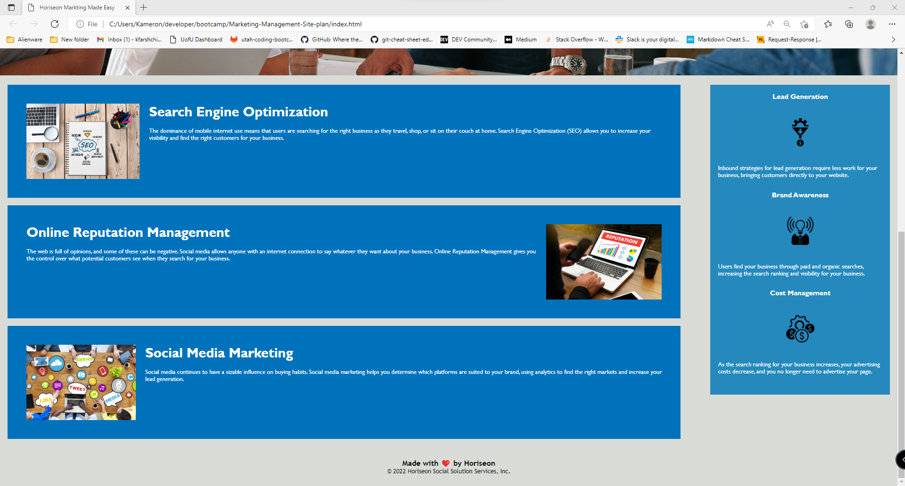

# Code Refactor Starter Code for Horiseon Markting Made Easy

## Description
I was given the starter code and an image what the website should look like. I then went into the index.html and style.css code and updated some of the code. I made sure the code is in semantic HTML and the file structure was in logical order in the index.html file. I added alt attibutes to the images. I changed the heading div to a nav bar so it was known to be the navigation bar. I also added a name in the title tag. 

## Installation

please add all files and folders since all have been updated. 

## Usage
https://kfarshchian.github.io/Marketing-Management-Site-plan/

## Credits

Xandromus - Starter code - https://github.com/coding-boot-camp/urban-octo-telegram

## License

Please refer to the LICENSE in the repo.
